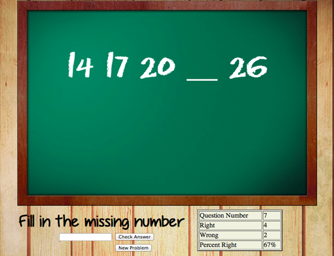

# Training-Project-3

## Number Sequences

> Goal: Create a site that will test pattern analysis

### Requirements

### Code

- HTML
- CSS
- JavaScript
  - - Using loops create a site that will randomly generate a number sequence where one of the numbers is blanked out. Allow the user to put the missing number in.
  - - Check to see if the number is correct and keep track of number correct and incorrect

> (doesn’t need to look that fancy, but you can if you want)
